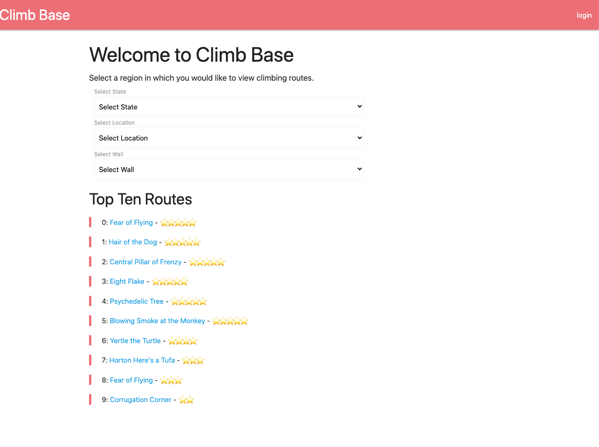
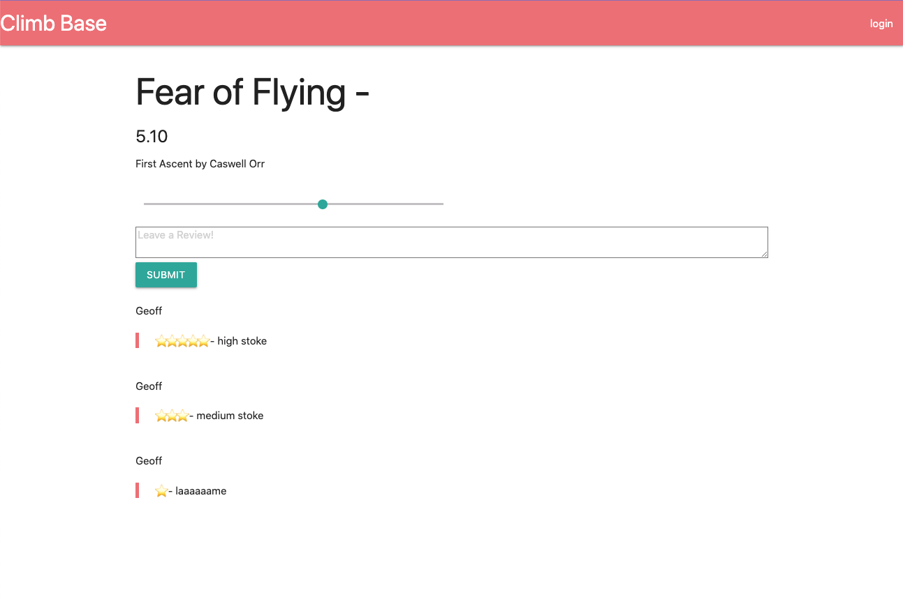

## Climb Base 

Climb Base is a database of user submitted rock climbs. Anyone can make an account and add their favorite locations and specific climbs. Users can also leave 
reviews and ratings on all climbs.

## Table of Contents
<a href="#description">Description</a>

<a href="#installation">Installation</a>

<a href="#usage">Usage</a>

<a href="#license">License</a>

<a href="#contributing">Contributing</a>

<a href="#Screen-Shots">Deployed Application</a>

<a href="#Deployed-Application">Deployed Application</a>

## Description
This application is created for users to have a place to share and voice their own opinions about their favorite climbs. We believe that giving users 
the platform to provide this data and engage with their community is the best thing that we, as fellow members of the community, can do for the community.

The database is structured such that routes are at walls, walls are at locations and locations are within states.

## Installation
Devependencies include SQL, MySQL, Handlebars, Express and more. All dependencies listed in package.json. 

## License
This application is covered under the MIT license.

## Contributing
Dylan Honeyman, Caswell Orr and Charlie Stedman

## Questions
Our GitHub Profiles: Dylan Honeyman, Caswell Orr and Charlie Stedman (respectively)

<a href="https://github.com/dhoneyman">Dylan Honeyman GitHub Profile Link</a>

<a href="https://github.com/caswellorr">Caswell Orr GitHub Profile Link</a>

<a href="https://github.com/cbs9646">Charlie Stedman GitHub Profile Link</a>

## Screen-Shots

## Deployed-Application

Project GitHub Repository: https://github.com/dhoneyman/Climb-Base

Project Deployed Heroku Link: https://climb-base.herokuapp.com/

